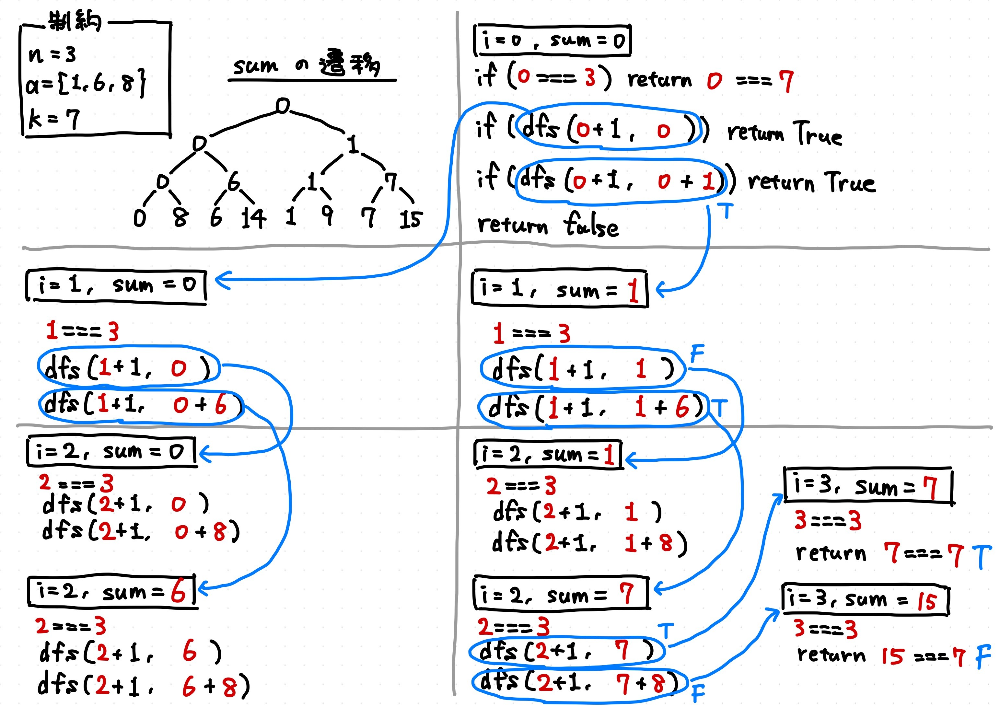

# 部分和問題

n個の数字からいくつか選ぶ．数字の和がkになる選び方があるならYes，ないならNoを出力する．

## 解法

- [O(2^n)時間の解法](./2n.ts)

||
|:-:|
|深さ優先探索|

深さ優先探索（Depth-First Search）を使う．
全経路の列挙や，行き止まりまでの探索（スタック・再帰利用）に適している．

## 参考文献

- p.34-35
