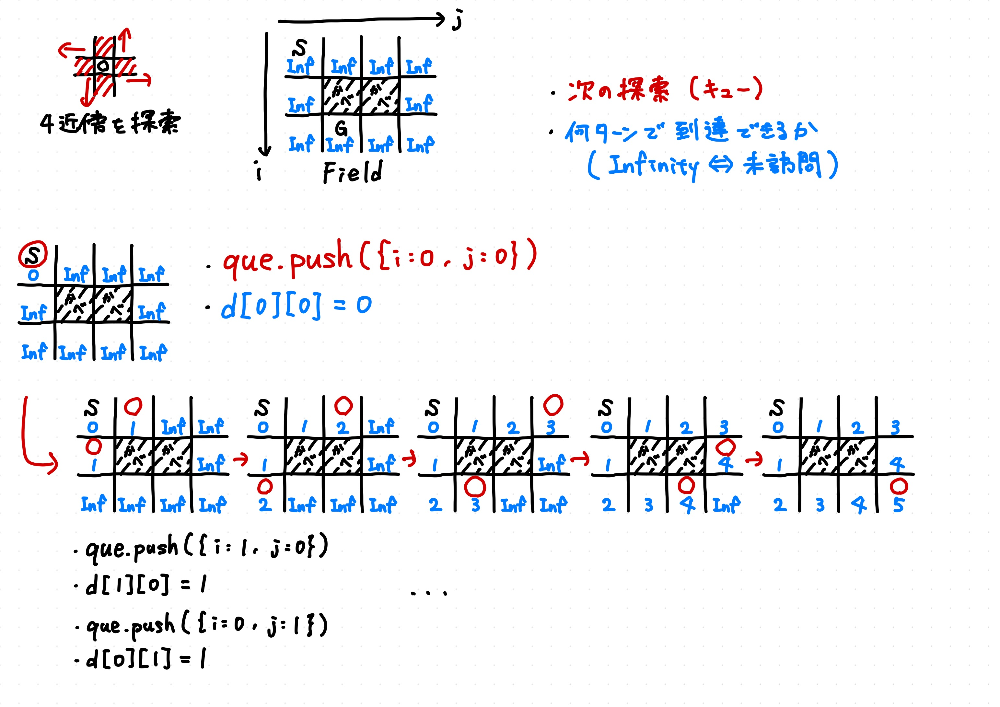

# 迷路の最短路

1ターンで隣接する4近傍の通路へ移動できる．
スタートからゴールへの最小ターン数を求めたい．
横N，縦Mのフィールドで，`#`を壁，`.`を通路，`S`をスタート，`G`をゴールとする．

## 解説

- [O(nm)時間の解法](./nm.ts)

||
|:-:|
|幅優先探索|

幅優先探索（BFS: Breadth-First Search）を使う．
最短経路や最短手数の探索に適している．

スタートを起点に，そこから繋がっている通路に何ターンで行けたかを記録していく．
分岐がある場合は分岐先を同時に探索していく．
訪問済みの通路だった場合，もっと短く行ける経路があるということなので，それ以上探索しない．
各通路タイルにつきBFSは0~1回しか呼ばれないので， $O(4 \times N \times M)=O(N \times M)$ で収まる．

## 参考文献

- p.37-39
